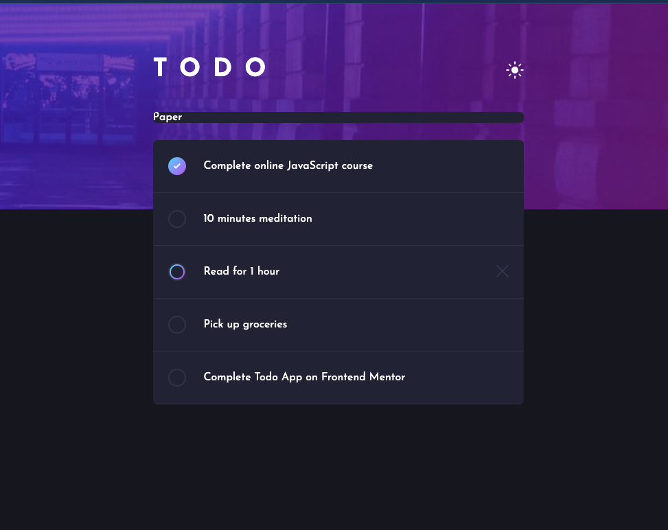

# Frontend Mentor - Todo App Solution


👋 Hi Hi...

This is a solution to the [Todo App challenge on Frontend Mentor](https://www.frontendmentor.io/challenges/todo-app-Su1_KokOW). This `README` document is following the general outline provided from the [Frontend Mentor Challenge](./README-template.md).

## Table of Contents

- [Overview](#overview)
  - [The Challenge](#the-challenge)
  - [Screenshot](#screenshot)
  - [Links](#links)
- [Dev Process](#my-process)
  - [Built With](#built-with)
    - [Getting Started](#getting-started)
    - [Deploy on Vercel](#deploy-on-vercel)
  - [Learning Highlights](#learning-highlights)
  - [Continued Development](#continued-development)
  - [Useful Resources](#useful-resources)
- [Author](#author)
- [Acknowledgments](#acknowledgments)

## Overview

For this challenge I will be using [Next.js](https://nextjs.org/) for the Front-end framework which will take care of the server and React front-end.

- [Code Challenge Brief](./README_BRIEF.md)

## The Challenge

The code challenge is to build out a todo app and get it looking as close to the design as possible. Additional details can be found in the [Challenge Brief](./design/README_BRIEF.md).

> NOTE: *Open Note/Open Book*, Any tools are allowed to assist in completion of the challenge. This includes build tools, frameworks, and libraries.

**Application Requirements:**

- [x] View the optimal layout for the app depending on their device's screen size (responsive application)
- [x] See hover states for all interactive elements on the page
- [ ] Add new todos to the list
- [x] Mark todos as complete
- [x] Delete todos from the list
- [ ] Filter by all/active/complete todos
- [ ] Clear all completed todos
- [ ] Toggle light and dark mode
- [ ] **Bonus**: Drag and drop to reorder items on the list
- [ ] **Bonus**: Build this project as a full-stack application

### Screenshots

> [COMING SOON] Screenshots of the final application are coming but there will be some in progress shots

**Process Screenshot 05/17/2023:**


### Links

> [COMING SOON] Links to where the application is deployed will be updated when the application is in a deployable state

## Dev Process

Takeaways from the active development of the project.

### Built With

This is a [Next.js](https://nextjs.org/) project bootstrapped with [`create-next-app`](https://github.com/vercel/next.js/tree/canary/packages/create-next-app).

#### Getting Started

> [STARTER] Built leveraging `npx create-next-app@latest`, make all selections needed, Yes to Typescript on the project, and No to Tailwind for styling

First, install dependencies:

```bash
yarn install
```

Now, run the development server:

```bash
yarn dev
```

Open [http://localhost:3000](http://localhost:3000) with your browser to see the result.

This project uses [`next/font`](https://nextjs.org/docs/basic-features/font-optimization) to automatically optimize and load font families, from custom Google Fonts.

#### Deploy on Vercel

The application will be deployed to the [Vercel Platform](https://vercel.com/new?utm_medium=default-template&filter=next.js&utm_source=create-next-app&utm_campaign=create-next-app-readme).

Check out the [Next.js deployment documentation](https://nextjs.org/docs/deployment) for more details.

### Learning Highlights

- Using some great hacks for styling CSS gradients as borders that I have not used in a long time

### Continued Development

Items to expand upon after the base application has been built.

- [ ] Add user authentication
- [ ] Add serverless support
- [ ] Add database integration

### Useful Resources

- [Next.js Documentation](https://nextjs.org/docs) - learn about Next.js features and API.
- [Learn Next.js](https://nextjs.org/learn) - an interactive Next.js tutorial.
- [CSS Tricks](https://css-tricks.com/)
- [Gradient Border](https://css-tricks.com/gradient-borders-in-css/)

## Author

- LinkedIn - [Myron R Schippers Jr](https://www.linkedin.com/in/myron-schippers-jr/)
- Frontend Mentor - [@myronschippers](https://www.frontendmentor.io/profile/myronschippers)
- GitHub - [myronschippers](https://github.com/myronschippers)

## Acknowledgments

- Two thumbs way up for [CSS Tricks](https://css-tricks.com/) and their reference guides
